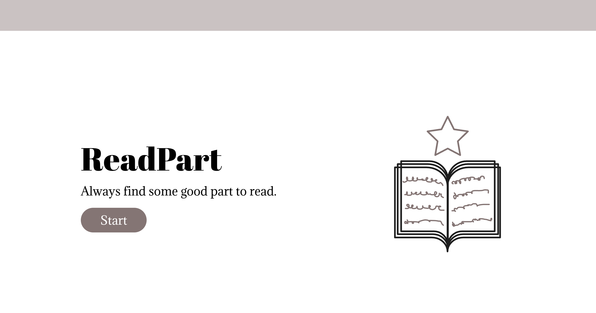
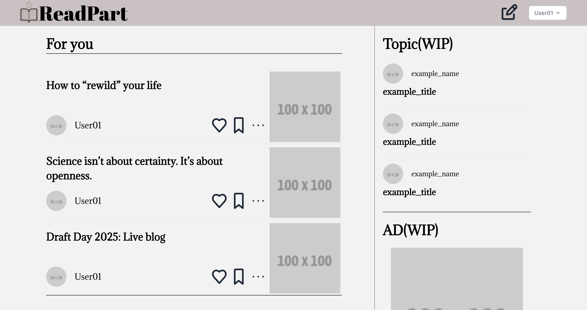

# ReadPart

一個基於 Laravel 打造的內容創作與分享平台，靈感來自 Medium。此專案仍在進行中，尚未完成

## 關於專案

ReadPart 是一個輕量級的內容分享平台，靈感來自 Medium，允許用戶創建、編輯和分享文章，並支援基本的用戶互動功能，例如評論和點讚。此專案主要用於熟悉 Laravel 框架使用，當前這是初版專案，專注於核心功能實現，使用 Laravel 框架開發，搭配 MySQL 資料庫和 Tailwind CSS 前端樣式。

## 功能

-   [x] **用戶系統**：註冊、登入、個人資料管理。
-   [x] **文章管理**：創建、編輯、刪除和發布文章。
-   [ ] **閱讀體驗**：支援 Markdown 格式的文章渲染。
-   [ ] **互動功能**：文章評論、點讚。
-   [ ] **響應式設計**：使用 Tailwind CSS 確保手機與桌面端的友好體驗。

## 螢幕截圖

以下是 ReadPart 的主要頁面展示：

首頁

文章列表


## 安裝與設定

### 環境需求

-   PHP >= 8.1
-   Composer
-   Node.js >= 22.x
-   MySQL 或其他 Laravel 支援的資料庫

### 執行步驟

1. 執行：
    ```bash
    composer run dev
    ```
